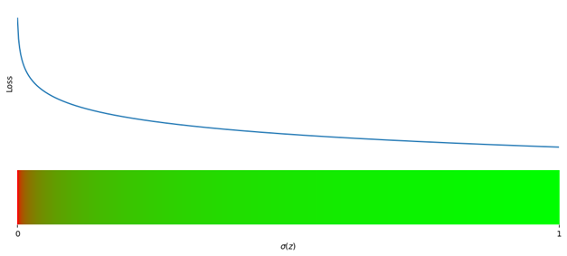
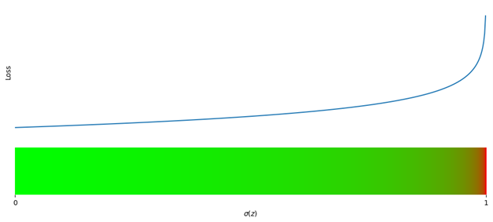

# Binary Cross-Entropy
The log loss, or binary cross entropy, is given by the following function.

$$\text{BCE}=-y\log{\left(\sigma(z)\right)}-(1-y)\log{\left(1-\sigma(z)\right)}$$

This programme shows how the log loss, aka Binary Cross Entropy ($\text{BCE}$), vary with different generated probabilities, $\sigma(z)$, for a given label $y$.

We see that loss increases exponentially as the probability output of a binary model deviates from the label.

## Label = 1

## Label = 2

